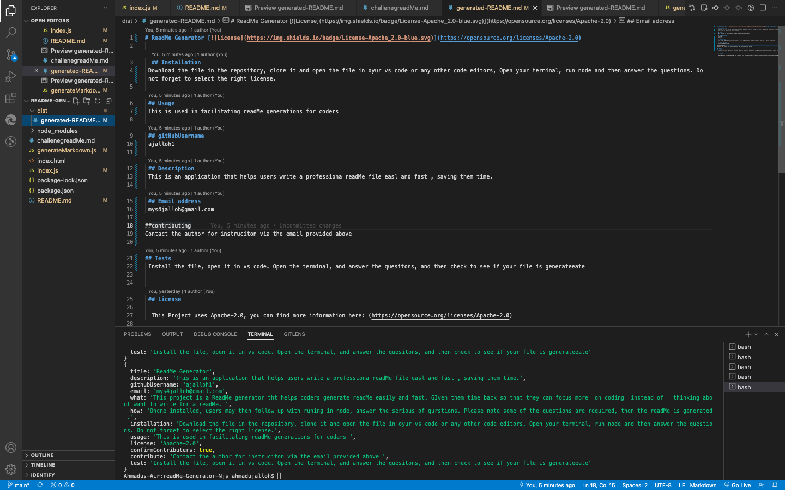
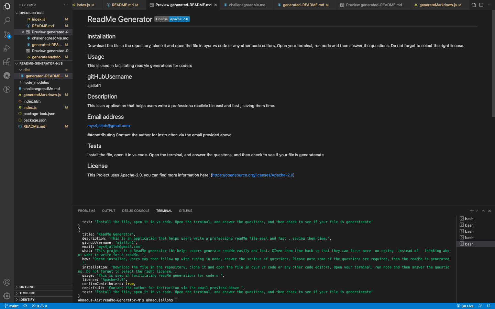

# readMe-Generator-Njs
## Table of Contents

1. [Description](#description)
2. [Installation](#installation)
3. [Usage](#usage)
5. [Contributing](#contributing)
6. [Tests](#tests)
7. [License](#license)
8. [Questions](#questions)

Next generation readMe generator

## Description
This is a ReadMe generator application. This application helps users generate a readme easily and fast. 
The application provides questions as a framework for the readme. All the user needs to do is to answer the questions and a professional read me is generated for them.
The application takes the stress of thinking about what question to include in the readme off of the plate of users, making it easy for them to generate a readme.

It saves users time and allow them to spend more time on writing codes instead of worrying about writing English.

## Installation

To install the application, you will need to download the file in the repository, clone it and open the file in a code editor such as VS CODE. 
Open the right file in the terminal and run node then answer the prompt questions. Do not forget to select the correct license for it to run. 

## Usage
Once the file is successfully installed, you can then follow up with running it in node. Answer all questions, some are required. Your file will be generated.
The app can be very useful to developer as it’s easy to use and therefore can be a motivation for developers to include a readme to their projects.

## Contributing
Third party contributions are allowed, but you must first contact the author via the email provided and or phone number. If having any technical issue,
please submit a ticket to our support team.

## Tests
Install the file, open it in VS code. Open it in the terminal, and answer the questions, and check to see if it populates in the readMed files

## Questions

For any questions inquiries, please reachout to me via email or git link. Thank you.

## videoDemo (https://drive.google.com/file/d/1506C4Se1bqRKfPe3C8Q-ka8QBFR9RB9_/view

- **Github:** [my github](https://ajalloh1.github.io/readMe-Generator-Njs/)
- **Email:** [jalloh@gmail.com](jalloh@gmail.co)
## License

](https://opensource.org/licenses/Apache-2.0)